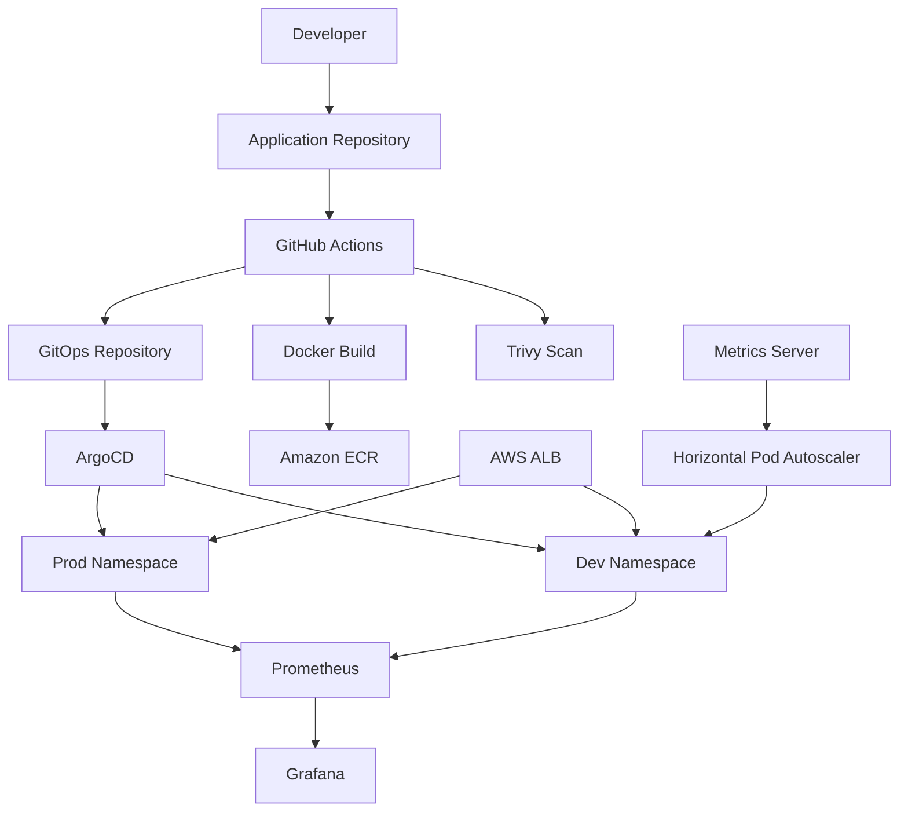

# Secure Multi-Environment EKS GitOps Platform

A production-style AWS platform engineering project that provisions Kubernetes infrastructure with Terraform, deploys applications through GitOps, integrates CI security controls, separates development and production environments, and adds monitoring and autoscaling.

The project was built end-to-end to demonstrate practical ownership of infrastructure, CI/CD, Kubernetes, security, observability, and troubleshooting.

---

## Architecture



---

## What I Built

The platform includes:

- Terraform-managed AWS infrastructure
- Multi-AZ VPC with public and private subnets
- Private Amazon EKS worker nodes
- Amazon ECR
- GitHub Actions CI
- GitHub-to-AWS OIDC authentication
- Trivy container vulnerability scanning
- Checkov Terraform scanning
- ArgoCD GitOps delivery
- Separate `dev` and `prod` namespaces
- AWS Load Balancer Controller
- Prometheus and Grafana
- Kubernetes Metrics Server
- Horizontal Pod Autoscaling
- Terraform remote state in S3

---

## Tech Stack

| Area | Technology |
|---|---|
| Cloud | AWS |
| IaC | Terraform |
| Containers | Docker |
| Kubernetes | Amazon EKS |
| Registry | Amazon ECR |
| CI | GitHub Actions |
| GitOps | ArgoCD |
| Security | Trivy, Checkov |
| Monitoring | Prometheus, Grafana |
| Autoscaling | Kubernetes HPA |
| Authentication | GitHub OIDC, IAM |

---

## CI/CD and GitOps Flow

```text
Application commit
      ↓
GitHub Actions
      ↓
Validation / Build
      ↓
Trivy image scan
      ↓
Push immutable SHA-tagged image to ECR
      ↓
Update dev Kubernetes manifest
      ↓
ArgoCD detects Git change
      ↓
Automatic dev deployment
```

GitHub Actions handles continuous integration.

ArgoCD owns deployment into Kubernetes, so CI does not directly run `kubectl apply`.

### Development

`dev` uses:

- automated sync
- pruning
- self-healing

### Production

`prod` uses deliberate promotion.

A tested image is explicitly promoted by updating the production manifest and manually syncing the ArgoCD application.

This prevents every application commit from becoming an automatic production deployment.

---

## Security

Security controls implemented in the platform include:

- GitHub Actions authentication to AWS using OIDC
- no long-lived AWS access keys in CI
- least-privilege IAM policies
- immutable ECR image tags
- ECR scan-on-push
- Trivy HIGH/CRITICAL vulnerability gating
- Checkov IaC scanning in GitHub Actions
- restricted EKS public API CIDRs
- EKS control-plane logging
- VPC Flow Logs
- locked-down default VPC security group

Checkov findings were reviewed individually rather than blindly suppressed. Accepted exceptions are explicitly defined in the CI workflow.

---

## Observability

The cluster uses `kube-prometheus-stack`, providing:

- Prometheus
- Grafana
- kube-state-metrics
- node-exporter
- Alertmanager
- Prometheus Operator

This provides visibility into:

- pod CPU and memory
- namespace resource usage
- node health
- Kubernetes object state
- workload behaviour

Grafana is accessed locally through port forwarding rather than being exposed publicly.

---

## Horizontal Pod Autoscaling

The development workload uses an `autoscaling/v2` HPA.

```text
Minimum replicas: 1
Maximum replicas: 4
Metric: CPU utilization
Target: 50%
```

The application defines CPU and memory requests so the HPA can calculate utilization correctly.

During load testing:

```text
1 replica
   ↓
sustained HTTP traffic
   ↓
CPU utilization increased
   ↓
HPA scaled to 4 replicas
   ↓
traffic stopped
   ↓
scale-down stabilization
   ↓
returned to 1 replica
```

This validated both scale-out and scale-in behaviour.

---

## Repository Structure

```text
secure-eks-gitops-platform/
├── .github/
│   └── workflows/
├── bootstrap/
│   └── Terraform remote-state infrastructure
├── terraform/
│   ├── backend.tf
│   ├── providers.tf
│   ├── variables.tf
│   ├── vpc.tf
│   ├── networking.tf
│   ├── eks.tf
│   ├── ecr.tf
│   ├── iam.tf
│   └── logging.tf
├── k8s/
│   ├── argocd/
│   ├── dev/
│   ├── prod/
│   └── system/
├── .gitignore
└── README.md
```

The application source and application CI workflow are maintained in a separate repository.

---

## Key Engineering Challenges

### EKS Authentication

AWS credentials were valid, but `kubectl` could not access the cluster.

The issue was EKS authorization rather than IAM authentication.

The final access path was:

```text
IAM principal
    ↓
EKS Access Entry
    ↓
EKS Access Policy
    ↓
Kubernetes permissions
```

### ARM64 vs AMD64 Images

The application was initially built on Apple Silicon and failed on AMD64 EKS worker nodes.

The Docker build was updated to target:

```text
linux/amd64
```

### Terraform Teardown

Terraform destroy initially failed because AWS Load Balancer Controller-managed resources still existed inside the VPC.

This highlighted an important ownership boundary:

```text
Terraform
    → AWS infrastructure

AWS Load Balancer Controller
    → ALB-related resources created from Kubernetes Ingress
```

### Checkov Local vs CI

Checkov passed locally but initially failed in GitHub Actions because a Terraform variable value existed only in the local environment.

A safe CI-specific tfvars file was added so the remote runner could evaluate the same configuration.

### ArgoCD vs HPA

ArgoCD and the HPA initially both affected Deployment replica count.

The final design gives HPA ownership of:

```text
/spec/replicas
```

while ArgoCD manages the rest of the Deployment.

---

## Reproducing the Platform

### 1. Bootstrap remote state

```bash
cd bootstrap
terraform init
terraform apply
```

### 2. Provision AWS infrastructure

```bash
cd ../terraform
terraform init
terraform plan
terraform apply
```

### 3. Configure kubectl

```bash
aws eks update-kubeconfig \
  --region eu-west-2 \
  --name multienv_eks_master
```

### 4. Install platform components

Install:

- AWS Load Balancer Controller
- ArgoCD
- kube-prometheus-stack
- Metrics Server

### 5. Apply ArgoCD applications

```bash
kubectl apply -f k8s/argocd/dev-application.yaml
kubectl apply -f k8s/argocd/prod-application.yaml
```

---

## Validation

Useful checks:

```bash
kubectl get nodes
kubectl get pods -A
kubectl get applications -n argocd
kubectl get hpa -n dev
kubectl top pods -n dev
terraform plan
```

A fully reconciled Terraform environment should return:

```text
No changes. Your infrastructure matches the configuration.
```

---

## Screenshots

Suggested evidence:

- ArgoCD showing healthy `dev` and `prod` applications
- Grafana Kubernetes dashboard
- HPA scaling from 1 to 4 replicas
- HPA scale-in back to 1 replica

---

## Project Status

**Complete**

Validated outcomes include:

- reproducible AWS infrastructure
- secure EKS deployment
- CI with OIDC authentication
- Trivy and Checkov security gates
- GitOps deployment through ArgoCD
- separate dev and prod environments
- Prometheus and Grafana monitoring
- HPA scale-out from 1 to 4 replicas
- scale-in back to 1 replica
- zero Terraform drift after final reconciliation
